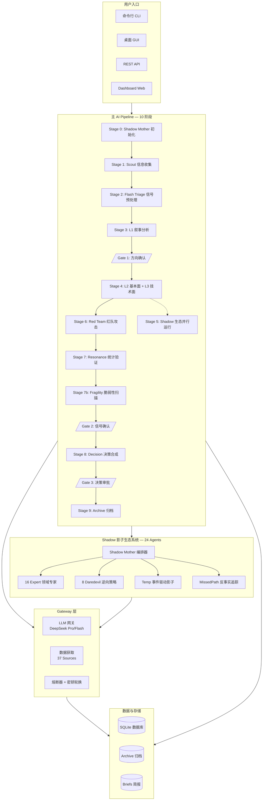
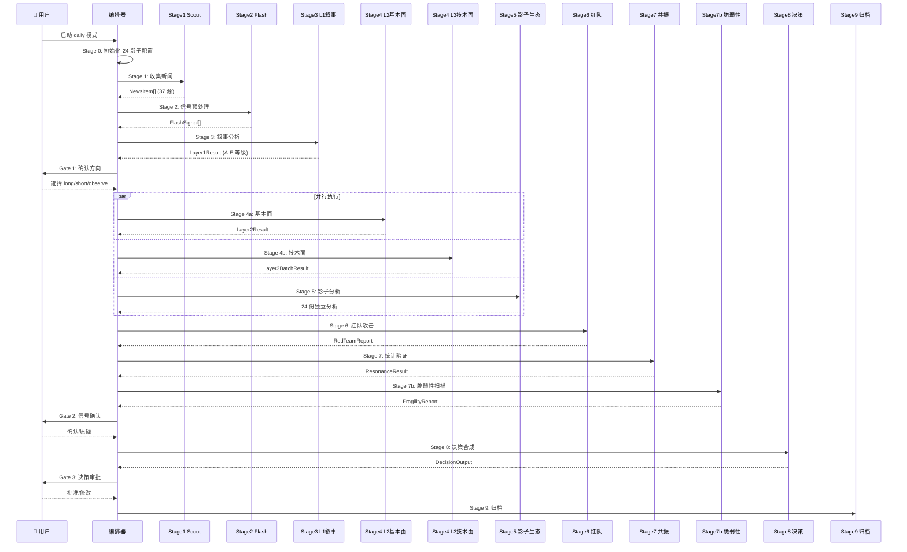
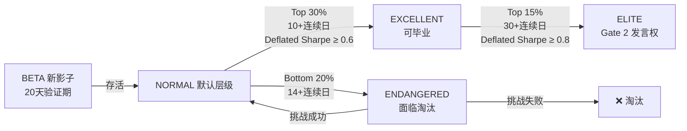
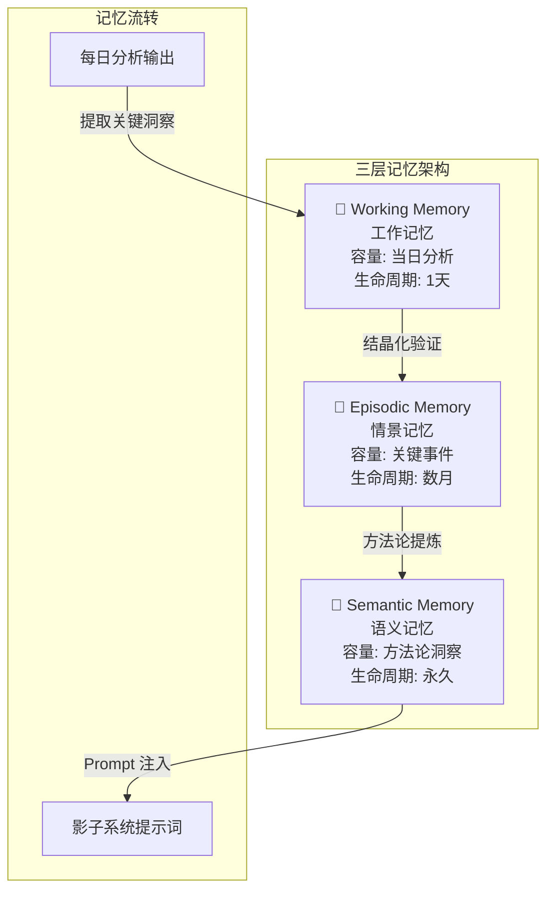
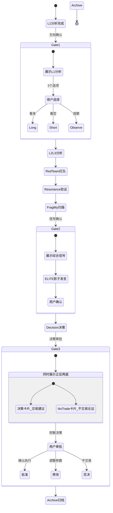
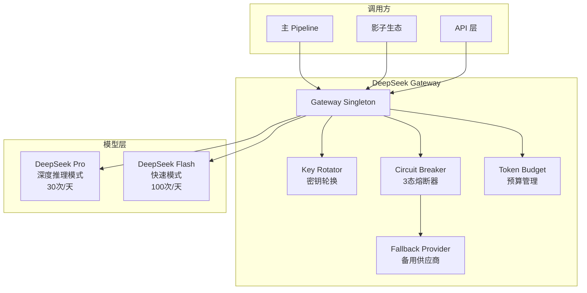
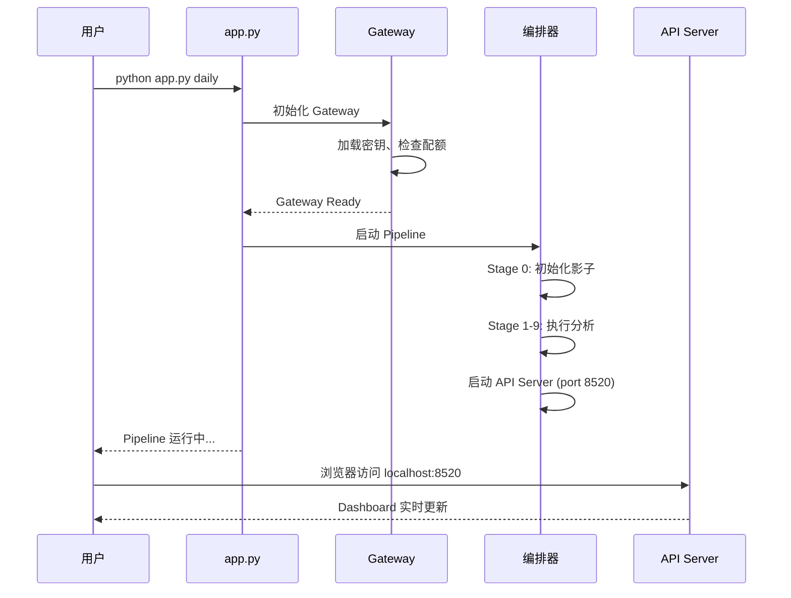

# MarketMind — AI 投资分析工作站：完整架构与机制报告

> **讲解用途**：团队内部培训 / 新人 onboarding / 投资人演示
> **更新日期**：2026-06-08
> **项目规模**：~54,000 行 Python，1,998+ 测试，24 个影子 Agent，37 个信息源，10 阶段主 Pipeline

---

## 目录

1. [系统概览](#1-系统概览)
2. [主 AI Pipeline：10 阶段分析流程](#2-主-ai-pipeline10-阶段分析流程)
3. [Shadow 影子生态系统：24 个虚拟基金经理](#3-shadow-影子生态系统24-个虚拟基金经理)
4. [三层 Gate 决策关卡](#4-三层-gate-决策关卡)
5. [数据流与信息架构](#5-数据流与信息架构)
6. [Gateway 层：LLM 网关与数据获取](#6-gateway-层llm-网关与数据获取)
7. [决策引擎：从分析到交易卡片](#7-决策引擎从分析到交易卡片)
8. [API 与前端展示层](#8-api-与前端展示层)
9. [关键设计原则](#9-关键设计原则)
10. [运行模式与部署](#10-运行模式与部署)

---

## 1. 系统概览

### 1.1 MarketMind 是什么？

MarketMind 是一个 **AI 驱动的个人投资分析工作站**。它每天自动收集全球财经新闻，通过多层 LLM Pipeline 进行深度分析，最终输出结构化的投资决策卡片。与此同时，一个由 24 个独立 AI Agent 组成的"影子生态系统"在后台并行运行——每个 Agent 都是一个拥有独立领域、策略和方法论的虚拟基金经理。

**核心定位**：AI 做分析，人类做决策。MarketMind **不执行实际交易**。

### 1.2 核心数字

| 指标 | 数值 |
|------|:----:|
| 信息源 | 37（31 RSS + 3 API + 1 SEC + 2 社交） |
| 影子 Agent | 24（16 Expert + 8 Daredevil） |
| 主 Pipeline 阶段 | 10 + 3 交互关卡 |
| 测试数量 | 1,998+，全部通过 |
| 代码规模 | ~54,000 行 Python |
| 技术栈 | Python / FastAPI / asyncio / DeepSeek / SQLite / CustomTkinter |

### 1.3 系统全景架构图



### 1.4 模块地图

```
projects/marketmind/
├── app.py                  # CLI 入口（166 行）
├── api_server.py           # API 服务器入口（27 行）
├── backtest_runner.py      # 回测运行器
│
├── pipeline/               # 🔵 主 AI Pipeline（93 文件，~54,000 行）
│   ├── orchestration.py    #   核心编排器（837 行）
│   ├── scout.py            #   信息收集（466 行）
│   ├── layer1_narrative.py #   L1 叙事分析（277 行）
│   ├── layer2_fundamental.py # L2 基本面分析（289 行）
│   ├── layer3_technical.py #   L3 技术面分析（~300 行）
│   ├── decision.py         #   决策合成（638 行）
│   ├── red_team.py         #   红队攻击（~200 行）
│   ├── resonance.py        #   统计验证（~200 行）
│   └── fragility_scanner.py # 脆弱性扫描（~100 行）
│
├── shadows/                # 🟢 影子生态系统（81 文件）
│   ├── shadow_mother.py    #   生态编排器（556 行）
│   ├── shadow_agent.py     #   核心 Agent（666 行）
│   ├── shadow_state.py     #   状态持久化（316 行）
│   ├── shadow_schema.py    #   数据模型（421 行，v12）
│   ├── shadow_memory.py    #   三层记忆系统（572 行）
│   ├── shadow_ranking_compute.py # 排名计算（235 行）
│   ├── challenger_engine.py #  淘汰引擎（~300 行）
│   └── collusion_detector.py # 集中度检测（~100 行）
│
├── gateway/                # 🟡 Gateway 层（20 文件）
│   ├── async_client.py     #   LLM 网关（600 行）
│   ├── market_data.py      #   市场数据（374 行）
│   ├── macro_data.py       #   宏观数据（481 行）
│   └── ...                 #   15+ 数据获取器
│
├── api/                    # 🟣 API 层（5 文件）
│   ├── routes.py           #   REST + WebSocket（286 行）
│   └── data_providers.py   #   数据提供（565 行）
│
├── ui/                     # 🟠 桌面 GUI（13 文件）
│   └── main_window.py      #   主窗口（302 行）
│
├── config/                 # ⚙️ 配置（12 文件）
│   ├── settings.py         #   全局配置（205 行）
│   └── source_authority.py #   信息源权威分级（140 行）
│
├── storage/                # 💾 持久化（4 文件）
├── notification/           # 🔔 告警系统（5 文件）
├── integrity/              # 🛡️ 完整性校验（4 文件）
├── evolution/              # 📈 进化监控（4 文件）
├── playground/             # 🧪 实验沙盒（7 文件）
└── tests/                  # ✅ 测试套件（17 测试文件）
```

---

## 2. 主 AI Pipeline：10 阶段分析流程

### 2.1 流程图



### 2.2 各阶段详解

#### Stage 0 — Shadow Mother 初始化

**文件**：`pipeline/orchestration.py` → `shadow_mother.py`

创建 24 个影子的配置和数据库 Schema。这一步确保影子生态系统在 Pipeline 开始前就准备好接收信息。

#### Stage 1 — Scout 信息收集

**文件**：`pipeline/scout.py`（466 行）

从 37 个信息源并发拉取新闻：
- **31 个 RSS 源**：Reuters、Bloomberg、CNBC、Financial Times、WSJ 等
- **3 个 API 源**：GNews、NewsAPI、Finnhub
- **1 个 SEC 源**：EDGAR 监管文件
- **2 个社交源**：Reddit、Twitter/X

**信息来源权威分级**（`config/source_authority.py`）：

| 等级 | 含义 | 示例 |
|------|------|------|
| PRIMARY | 一级权威源 | Reuters、Bloomberg |
| RELIABLE | 可靠源 | CNBC、Financial Times |
| FRAGILE | 需交叉验证 | Reddit、Twitter |
| BEST_EFFORT | 尽力而为 | 小型博客 |

**去重与聚类**：基于标题相似度和语义嵌入进行新闻去重，同一事件的不同报道被聚合为一个事件簇。

#### Stage 2 — Flash Triage 信号预处理

**文件**：`pipeline/flash_preprocessor.py`（~150 行）

使用 DeepSeek Flash（快速模型，无推理模式）对原始新闻进行第一轮筛选：
- 过滤噪音（非市场相关新闻）
- 提取关键信号：事件类型、影响资产类别、初步方向判断
- 输出结构化 `FlashSignal[]`

**为什么用 Flash 而不是 Pro？** 这一步需要处理大量新闻条目，速度快、成本低比深度分析更重要。Flash 模型关闭推理模式后延迟极低。

#### Stage 3 — L1 叙事分析

**文件**：`pipeline/layer1_narrative.py`（277 行）

使用 DeepSeek Pro（深度推理模式）对筛选后的信号进行第一层深度分析。

**输出数据结构 `Layer1Result`**：

| 字段 | 类型 | 说明 |
|------|------|------|
| `event_grade` | A-E | A=货币政策, B=公司事件, C=监管, D=地缘政治, E=宏观 |
| `surprise_level` | high/low | 市场意外程度 |
| `market_size` | big/small | 影响市场规模 |
| `matrix_quadrant` | enum | 2×2 矩阵：核心机会/趋势机会/套利/观察跳过 |
| `price_in_score` | 0.0-1.0 | 价格反映程度（低=未被定价） |
| `cascade_rank` | 1-3 | 级联效应层级 |
| `cascade_hub` | bool | 是否会触发级联效应 |
| `sentiment_direction` | bullish/bearish/neutral | 情绪方向 |
| `tail_risk_flags` | list | 尾部风险标记 |

**2×2 决策矩阵**：

```
                高惊喜度            低惊喜度
            ┌──────────────┬──────────────┐
  大市场    │  核心机会      │  趋势机会      │
            │  (重点分析)    │  (跟随趋势)    │
            ├──────────────┼──────────────┤
  小市场    │  套利机会      │  观察/跳过     │
            │  (快速套利)    │  (不浪费Token) │
            └──────────────┴──────────────┘
```

**级联效应分析**：
- **一阶效应**（直接冲击）：例如加息 → 债券收益率上升
- **二阶效应**（传导）：债券收益率上升 → 成长股估值承压
- **三阶效应**（反馈）：成长股下跌 → 风险偏好收缩 → 更多资产被抛售

#### Stage 4 — L2 基本面 + L3 技术面（并行）

**L2 基本面**（`pipeline/layer2_fundamental.py`，289 行）：

五层递进分析框架：
```
宏观象限 → 资产类别 → 行业板块 → 因子评分 → 个股筛选
```

1. **宏观象限**：扩张/放缓/收缩/复苏
2. **资产类别**：股票/债券/商品/现金的配置方向
3. **行业板块**：在选定资产类别内筛选强势板块
4. **因子评分**：价值/动量/质量/波动率/规模因子
5. **个股候选**：最终输出候选股票列表

输出 `Layer2Result`：
- `macro_quadrant`: 宏观象限
- `sector_shortlist`: 优势行业列表
- `ticker_candidates`: 候选股票
- `strategy_groups`: 策略分组（保守/中性/激进）

**L3 技术面**（`pipeline/layer3_technical.py`，~300 行）：

绿/黄/红 三灯系统：
- 🟢 **绿灯**：技术指标支持入场（趋势向上、支撑位有效、量价配合）
- 🟡 **黄灯**：技术指标中性（震荡区间、方向不明）
- 🔴 **红灯**：技术指标警告（破位、量价背离、超买超卖极端）

#### Stage 5 — Shadow 生态并行运行

**与 L2+L3 同时执行**。24 个影子 Agent 独立分析相同的原始新闻（但**看不到 L1/L2/L3 的分析结论**，防止锚定偏差）。

详见 [第 3 章](#3-shadow-影子生态系统24-个虚拟基金经理)。

#### Stage 6 — Red Team 红队攻击

**文件**：`pipeline/red_team.py`（~200 行）

对 L1+L2+L3 的分析结论进行系统性攻击：
- **逻辑漏洞**：分析链条中是否有推理跳跃
- **反事实挑战**：如果前提条件改变，结论是否仍然成立
- **替代解释**：同样的数据是否有不同的解读
- **最坏情况**：如果判断错误，最大损失是多少

输出 `RedTeamReport`：每个挑战附带严重度评级。

#### Stage 7 — Resonance 统计验证

**文件**：`pipeline/resonance.py`（~200 行）

三种统计验证方法：

| 方法 | 全称 | 作用 |
|------|------|------|
| **DSR** | Deflated Sharpe Ratio | 考虑多次试验后的真实 Sharpe（防过拟合） |
| **PBO** | Probability of Backtest Overfitting | 回测过拟合概率 |
| **CSCV** | Combinatorially Symmetric Cross-Validation | 组合对称交叉验证 |

**PBO 反馈闭环**：如果 PBO > 0.5（过拟合概率高），自动降低该策略的权重并标记为"需人工复核"。

#### Stage 7b — Fragility 脆弱性扫描

**文件**：`pipeline/fragility_scanner.py`（~100 行）

扫描当前市场环境的脆弱性：
- 关键阈值是否被突破
- 跨资产相关性是否异常
- 波动率曲面是否有极端形态
- 流动性指标是否恶化

输出 `FragilityReport`：整体脆弱性评分 + 被突破的阈值列表。

#### Stage 8 — Decision 决策合成

**文件**：`pipeline/decision.py`（638 行）

这是整个 Pipeline 的最终输出阶段。详见 [第 7 章](#7-决策引擎从分析到交易卡片)。

#### Stage 9 — Archive 归档

将所有分析结果、决策卡片、影子投票保存到 SQLite 数据库，用于：
- 历史回溯和绩效追踪
- 模型校准（对比预测 vs 实际）
- 审计和合规记录

---

## 3. Shadow 影子生态系统：24 个虚拟基金经理

### 3.1 生态全景图

```mermaid
graph TB
    subgraph 影子类型["影子类型 — 24 Agents"]
        E1[🥇 Gold 黄金专家]
        E2[🪙 Crypto 加密货币]
        E3[⛽ Energy 能源]
        E4[📊 Bonds 债券]
        E5[📉 Vol 波动率]
        E6[🌍 Emerging 新兴市场]
        E7[💻 Tech 科技]
        E8[🏦 Financials 金融]
        E9[💊 Healthcare 医疗]
        E10[🛒 Consumer 消费]
        E11[🏭 Industrials 工业]
        E12[⛏ Metals 金属]
        E13[🏠 RealEstate 房地产]
        E14[💱 FX 外汇]
        E15[🌐 Macro 宏观]
        E16[🔻 Short 做空]
        D1[🎯 Range-Bound]
        D2[📈 Momentum]
        D3[🔄 Reversal]
        D4[D4-D8...]
        T[Temp 事件驱动]
        M[MissedPath 反事实]
    end

    subgraph 层级系统["五级分层"]
        ELITE[👑 ELITE<br/>Top 15%<br/>Gate 2 发言权]
        EXCELLENT[⭐ EXCELLENT<br/>Top 30%<br/>可毕业]
        NORMAL[📊 NORMAL<br/>默认层级]
        ENDANGERED[⚠️ ENDANGERED<br/>Bottom 20%<br/>面临淘汰]
        BETA[🥚 BETA<br/>新影子<br/>20天验证期]
    end

    subgraph 每日循环["每日循环 — 11 步"]
        direction TB
        A[1. 扫描事件<br/>创建/销毁临时影子]
        B[2. 创建 MissedPath<br/>反事实追踪]
        C[3. 生成状态卡片]
        D[4. 并行运行分析<br/>24 影子同时执行]
        E[5. 计算排名<br/>复合评分]
        F[6. 纸面-实盘校准]
        G[7. 集中度检测]
        H[8. 健康检查+审计]
        I[9. 记忆更新+结晶]
        J[10. 挑战者淘汰]
        K[11. 紧急配额审计]

        A --> B --> C --> D --> E --> F --> G --> H --> I --> J --> K
    end

    影子类型 --> 层级系统
    层级系统 --> 每日循环
```



### 3.2 影子类型详解

#### Expert 专家型（16 个）

每个 Expert 拥有一个专属领域和深度知识库：

| # | 影子 | 领域 | 核心方法论 |
|:--:|------|------|------|
| 1 | Gold | 黄金 | 实际利率、央行储备、避险需求 |
| 2 | Crypto | 加密货币 | 链上数据、监管动态、市场情绪 |
| 3 | Energy | 能源 | 供需平衡、地缘政治、库存数据 |
| 4 | Bonds | 债券 | 收益率曲线、信用利差、久期管理 |
| 5 | Vol | 波动率 | VIX 期限结构、波动率曲面、尾部对冲 |
| 6 | Emerging | 新兴市场 | 资本流动、汇率风险、政治风险 |
| 7 | Tech | 科技 | 产品周期、研发投入、估值框架 |
| 8 | Financials | 金融 | 利率敏感性、信用周期、监管 |
| 9 | Healthcare | 医疗 | FDA 管线、专利悬崖、医保政策 |
| 10 | Consumer | 消费 | 消费者信心、零售数据、品牌力 |
| 11 | Industrials | 工业 | PMI、资本开支、供应链 |
| 12 | Metals | 金属 | 工业需求、供给约束、库存周期 |
| 13 | RealEstate | 房地产 | 利率、空置率、REITs 估值 |
| 14 | FX | 外汇 | 利差、经常账户、央行干预 |
| 15 | Macro | 宏观 | GDP、就业、通胀、货币政策 |
| 16 | Short | 做空 | 财务造假识别、高估值爆破、催化剂 |

#### Daredevil 敢死队型（8 个）

采用非主流、高确信度的逆向策略：

| # | 策略 | 描述 |
|:--:|------|------|
| 1 | Range-Bound | 区间交易：识别均值回归机会 |
| 2 | Momentum | 趋势追踪：强者恒强 |
| 3 | Reversal | 反转策略：极端情绪的反向操作 |
| 4-8 | 多样化策略 | 包括配对交易、事件驱动、波动率套利等 |

#### 特殊影子

- **Temp（事件驱动）**：当日有重大事件时动态创建，事件结束后销毁
- **MissedPath（反事实追踪）**：追踪 Gate 处被否决的方向（"如果当时选了long会怎样？"）
- **Ecosystem Auditor（盲点扫描）**：Phase 0 引入的机制（非影子 Agent），每日扫描全部影子投票的结构性盲点——方向集中度、资产类别遗漏、方法论趋同、未覆盖标的。替代了旧版 Catfish Agent

### 3.3 五级分层制度



**层级权益**：

| 层级 | 权益 |
|------|------|
| **ELITE** | Gate 2 讨论权、紧急 Pro 配额、方法论变更投票 |
| **EXCELLENT** | 可申请毕业（进入主 Pipeline 辅助决策） |
| **NORMAL** | 完整分析权、参与排名 |
| **ENDANGERED** | 分析权保留，但进入挑战者淘汰流程 |
| **BETA** | 分析权保留，但不参与排名 |

### 3.4 排名算法

**文件**：`shadows/shadow_ranking_compute.py`（235 行）

**复合评分 MPPM（Multi-Period Performance Metric）**：

```
CompositeScore = w1 × Deflated_Sharpe + w2 × Calmar_Ratio + w3 × Omega_Ratio
                 + w4 × Win_Rate - w5 × Max_Drawdown_Penalty
                 + Market_Anchor_Bonus
```

**市场锚定**：如果影子表现优于基准指数（如 S&P 500），获得额外加分。

**平台期检测**：如果影子连续 60+ 天没有显著改善，标记为"平台期"，触发方法论重审。

### 3.5 记忆系统：三层架构

**文件**：`shadows/shadow_memory.py`（572 行）



- **Working Memory（工作记忆）**：当日分析数据，日终清空
- **Episodic Memory（情景记忆）**：关键市场事件和个人预测成败案例，保留数月
- **Semantic Memory（语义记忆）**：从经验中提炼的可复用方法论洞察，永久保留并注入到 Prompt 中

### 3.6 知识结晶化

**文件**：`shadows/crystallization.py`（~150 行）

```
洞察 → 假设 → 验证 → 行动
  │       │       │       │
  │       │       │       └── promote（注入方法论）
  │       │       └────────── retire（淘汰错误认知）
  │       └────────────────── hold（等待更多证据）
  └────────────────────────── 所有洞察进入验证队列
```

### 3.7 挑战者淘汰机制

**文件**：`shadows/challenger_engine.py`（~300 行）

三阶段淘汰流程：
1. **诊断阶段**：分析影子表现不佳的根因（方法论问题？领域不匹配？随机噪音？）
2. **挑战阶段**：给予影子一个"救赎机会"——用修改后的方法论在一个回测窗口上证明自己
3. **裁决阶段**：如果挑战失败 → 淘汰（保留历史数据用于学习）；如果挑战成功 → 恢复 NORMAL 层级

### 3.8 集中度检测

**文件**：`shadows/collusion_detector.py`（~100 行）和 `shadows/concentration_detector.py`

监控影子之间的方向集中度（lockstep movement）：
- 如果多个影子在同一标的上方向高度一致超过阈值天数 → 标记为方向集中
- 这<strong>不是"群体思维"检测</strong>——影子系统独立分析天然避免了群思问题。集中度检测的目的是识别市场信号过强导致的自然趋同 vs 独立判断的丧失
- 触发 Ecosystem Auditor 盲点扫描进行进一步诊断

### 3.9 信息防火墙

**核心规则**：影子**只能看到原始新闻**，不能看到主 Pipeline 的 L1/L2/L3 分析结论。

**目的**：
- 防止锚定偏差（Anchoring Bias）
- 确保影子分析完全独立
- 影子与主 Pipeline 的分歧正是最有价值的信号

---

## 4. 三层 Gate 决策关卡

### 4.1 Gate 架构



### 4.2 Gate 1 — 方向确认

**位置**：L1 叙事分析完成后

**展示内容**：
- L1 分析结果（事件等级 A-E、2×2 矩阵位置、情绪方向）
- 级联效应路径图
- 尾部风险提示

**用户选择**：
- **看多（Long）**：Pipeline 后续将聚焦做多机会
- **看空（Short）**：Pipeline 后续将聚焦做空机会
- **观察（Observe）**：不进场但持续追踪（被否决的方向由 MissedPath 影子追踪）

**设计理念**：人类在大方向判断上优于 AI（常识、直觉、对政策意图的理解），所以早期就让人类介入。

### 4.3 Gate 2 — 信号确认

**位置**：Red Team + Resonance + Fragility 完成后

Gate 2 汇总 L2/L3/Red Team/Resonance/Fragility 全部输出和 ELITE 影子发言，由用户确认是否继续推进到决策阶段。

**展示内容**：
- L2 基本面分析
- L3 技术面分析
- Red Team 攻击报告
- Resonance 统计验证结果（DSR/PBO/CSCV）
- Fragility 脆弱性评分
- **ELITE 影子发言**：只有顶级的 ELITE 影子可以在 Gate 2 发表意见

**用户操作**：确认继续 or 质疑并要求重新分析。

### 4.4 Gate 3 — 决策审批

**位置**：Decision 决策合成完成后

这是最终的人类决策关。系统**同时**展示正反两面：
- **决策卡片**（Decision Cards）：每个交易建议的结构化卡片，含入场区间、止损位、仓位等
- **不交易卡片**（No-Trade Card）：为什么不交易可能是更好的选择，含事前验尸分析
- **纸面交易**：建议先用虚拟资金验证
- **反向挑战**：故意提出的反面论点

两者一起呈现，用户在充分了解双方论点后做出权衡。

**用户选择**：
- **批准**：确认 Decision Cards 中的交易参数，进入执行
- **修改**：调整仓位大小、止损位等参数后执行
- **否决**：采纳 No-Trade Card 的论证，今天不做任何交易

---

## 5. 数据流与信息架构

### 5.1 完整数据流

```mermaid
flowchart LR
    subgraph 数据源["📡 数据源层"]
        RSS[31 RSS Feeds]
        API[3 API Sources]
        SEC[SEC EDGAR]
        Social[2 Social Media]
    end

    subgraph 采集["📥 采集层"]
        Scout[Scout 并发采集]
        Dedup[去重+聚类]
    end

    subgraph 处理["⚙️ 处理层"]
        Flash[Flash Triage]
        L1[L1 叙事分析]
        L2[L2 基本面]
        L3[L3 技术面]
        RT[Red Team]
        Res[Resonance]
        Frag[Fragility]
    end

    subgraph 决策["🎯 决策层"]
        Dec[Decision Engine]
        Cards[Decision Cards]
        NoTrade[No-Trade Card]
    end

    subgraph 影子["👥 影子层（并行）"]
        SM[Shadow Mother]
        SA[24 Shadow Agents]
        Rank[Ranking Engine]
        Mem[Memory System]
    end

    subgraph 存储["💾 存储层"]
        DB[(shadows.db)]
        Archive[(archive.db)]
        Briefs[(briefs/)]
    end

    subgraph 展示["📊 展示层"]
        Dashboard[Dashboard]
        API[REST API]
        GUI[Desktop GUI]
        Alerts[Alert System]
    end

    数据源 --> 采集
    采集 --> 处理
    处理 --> 决策
    采集 -.->|仅原始新闻| 影子
    影子 --> 存储
    处理 --> 存储
    决策 --> 存储
    决策 --> 展示
    存储 --> 展示
```



### 5.2 Token 预算分配

**文件**：`gateway/token_budget.py`（96 行）

每日预算：**200 万 Token**

```
┌──────────────────────────────────────────────────────┐
│              每日 Token 预算分配                       │
│                                                      │
│  主 Pipeline (60%): 120 万 Token                      │
│  ┌─────────────────────────────────────────────────┐ │
│  │ Scout(Flash) ████ 5%                            │ │
│  │ L1(Pro)      ████████████ 15%                   │ │
│  │ L2(Pro)      ██████████ 12%                     │ │
│  │ L3(Pro)      ██████████ 12%                     │ │
│  │ Red Team(Pro)████████ 10%                       │ │
│  │ Decision(Pro)██████ 6%                          │ │
│  └─────────────────────────────────────────────────┘ │
│                                                      │
│  影子生态 (40%): 80 万 Token                          │
│  ┌─────────────────────────────────────────────────┐ │
│  │ 16 Expert(Pro)  ████████████████████ 30%         │ │
│  │ 8 Daredevil(Pro)████████████ 15%                │ │
│  │ Memory/Crystal  ███ 5%                          │ │
│  └─────────────────────────────────────────────────┘ │
└──────────────────────────────────────────────────────┘
```

**Pro 调用限制**：每日最多 30 次 Pro 调用、100 次 Flash 调用。

### 5.3 信息防火墙设计

```
┌─────────────────────────────────────────────────────────┐
│                    信息防火墙                            │
│                                                         │
│  原始新闻 ──────┬──────→ 主 Pipeline (L1/L2/L3)         │
│                │         • 可访问所有分析结论            │
│                │         • 可访问影子排名                │
│                │                                        │
│                └──────→ 影子生态系统                     │
│                          • ❌ 看不到 L1/L2/L3 结论       │
│                          • ❌ 看不到其他影子的分析       │
│                          • ✅ 只看到原始新闻             │
│                          • ✅ 只看到自己的历史记忆       │
│                                                         │
│  影子排名 ←────────────── 主 Pipeline 可查看             │
│  集中度检测 ←────────────── 主 Pipeline 可查看             │
└─────────────────────────────────────────────────────────┘
```

---

## 6. Gateway 层：LLM 网关与数据获取

### 6.1 LLM 网关架构

**文件**：`gateway/async_client.py`（600 行）



**核心设计**：所有 LLM 调用必须通过 Gateway，**任何模块不得直接调用 httpx**。

**两种模型的使用场景**：

| 场景 | 模型 | 原因 |
|------|------|------|
| L1 叙事分析 | Pro | 需要深度推理 |
| L2 基本面 | Pro | 需要多步推理链 |
| L3 技术面 | Pro | 需要综合判断 |
| Red Team | Pro | 需要创造性挑战 |
| Decision | Pro | 最终决策需要深度思考 |
| Scout 标签 | Flash | 量大、速度快 |
| Flash Triage | Flash | 批量预处理 |
| 影子分析 | Pro | 每个影子需要独立深度分析 |

**Circuit Breaker（熔断器）**：3 态机
- **CLOSED**（正常）：请求正常通过
- **OPEN**（熔断）：连续失败超过阈值 → 快速失败，直接返回错误
- **HALF_OPEN**（半开）：经过冷却期后，允许少量探测请求通过

**Key Rotator（密钥轮换）**：预判配额不足时自动切换到备用密钥。

### 6.2 数据获取层

**20 个数据获取模块**：

| 模块 | 行数 | 数据内容 |
|------|:----:|------|
| `market_data.py` | 374 | yfinance: 股票 OHLCV、收益率、Beta |
| `macro_data.py` | 481 | FRED 宏观指标（利率、就业、CPI、PMI） |
| `fred_client.py` | 319 | FRED API 客户端 |
| `sentiment_fetcher.py` | 401 | 新闻情绪聚合 |
| `options_flow.py` | 297 | 期权流、Gamma Exposure |
| `vol_surface_fetcher.py` | 477 | 波动率曲面构建 |
| `vol_global_fetcher.py` | 211 | 全球波动率指数 |
| `commodity_fetcher.py` | 440 | 商品价格（黄金、原油、铜等） |
| `crypto_onchain.py` | 479 | 加密货币链上数据 |
| `cross_border.py` | 378 | 跨境资本流动 |
| `world_bank_fetcher.py` | 213 | 世界银行发展指标 |
| `multimodal_adapter.py` | 495 | Gemini Flash 图片/PDF/OCR 输入 |

---

## 7. 决策引擎：从分析到交易卡片

### 7.1 决策引擎架构

**文件**：`pipeline/decision.py`（638 行）

```mermaid
graph TB
    subgraph 输入["输入"]
        L1R[L1 叙事分析结果]
        L2R[L2 基本面结果]
        L3R[L3 技术面结果]
        RTR[Red Team 报告]
        ResR[Resonance 验证]
        FragR[Fragility 扫描]
        SR[影子排名 + ELITE 意见]
    end

    subgraph 决策引擎["Decision Engine"]
        direction TB
        SYNTH[信号合成<br/>多维度加权]
        CASH[现金重框<br/>"如果今天是现金会买吗？"]
        CONTRARIAN[反向挑战<br/>故意提出反面论点]
        SIZING[仓位计算<br/>Kelly × Fragility 折扣]
        RISK[风控检查<br/>止损/仓位上限/相关性]

        SYNTH --> CASH --> CONTRARIAN --> SIZING --> RISK
    end

    subgraph 输出["输出"]
        CARDS[Decision Cards<br/>交易决策卡片]
        NOTRADE[No-Trade Card<br/>不交易卡片]
        PAPER[Paper Trade<br/>纸面交易建议]
    end

    输入 --> 决策引擎
    决策引擎 --> 输出
```

### 7.2 Decision Card 数据结构

```python
@dataclass
class DecisionCard:
    ticker: str              # 股票代码
    direction: str           # long | short
    position_size_pct: float # 仓位比例（0.0-1.0）
    entry_low: float         # 入场区间下限
    entry_high: float        # 入场区间上限
    stop_loss: float         # 止损价
    target_price: float      # 目标价
    max_hold_days: int       # 最长持有天数
    reward_risk_ratio: float # 收益/风险比
    thesis: str              # 核心逻辑（3句话）
    risk_statement: str      # 风险声明
    red_team_note: str       # 红队质疑及回应
    cash_reframing: str      # 现金重框思考
```

### 7.3 No-Trade Card（不交易卡片）

**核心理念**：不交易本身也是一种决策。

```python
@dataclass
class NoTradeCard:
    thesis: str                    # 为什么不交易
    supporting_evidence: list[str] # 支撑证据
    counterfactual: str            # 反事实（什么条件下才应该交易）
    structural_advantages: list[str] # 当前持仓的结构性优势
    pre_mortem: str                # 事前验尸（如果交易了会怎么失败）
    no_trade_score: float          # 不交易评分（0-1）
```

### 7.4 现金重框（Cash Reframing）

**来源**：行为金融学研究

**问题**："如果我现在持有的是现金，我会买入这个资产吗？"

**目的**：对抗"禀赋效应"（Endowment Effect）——人们倾向于高估已持有资产的价值。通过强制现金视角，消除持仓偏见。

### 7.5 仓位计算公式

```
Position_Size = Base_Size × Kelly_Fraction × Fragility_Discount × Conviction_Weight

其中：
  Base_Size = 组合总价值 × 单标的上限比例（默认 15%）
  Kelly_Fraction = (Win_Prob × Avg_Win - Loss_Prob × Avg_Loss) / (Avg_Win × Avg_Loss)
  Fragility_Discount = 1.0 - Fragility_Score（环境越脆弱，仓位越小）
  Conviction_Weight = 信号一致性得分（L1/L2/L3/RedTeam/Resonance 的一致性）
```

---

## 8. API 与前端展示层

### 8.1 API 端点全景

**文件**：`api/routes.py`（286 行）

| 路由 | 方法 | 用途 |
|------|:----:|------|
| `/` | GET | Dashboard HTML 页面 |
| `/evolution` | GET | 进化可视化页面 |
| `/playground` | GET | 实验沙盒页面 |
| `/api/portfolio` | GET | 当前组合仓位 + 巡逻状态 |
| `/api/cost` | GET | Token/Pro 预算消耗 |
| `/api/log` | GET | 系统日志 |
| `/api/shadows/overview` | GET | 影子层级分布 |
| `/api/shadows/rankings` | GET | Top 5 排名影子 |
| `/api/shadows/{id}` | GET | 影子详情 |
| `/api/history/decisions` | GET | 历史决策记录 |
| `/api/info/inject` | POST | 用户信息注入（文本+文件） |
| `/api/chat` | POST | AI 对话（含会话追踪） |
| `/api/chat/history` | GET | 聊天历史 |
| `/api/chat/history` | DELETE | 清除聊天历史 |
| `/api/alerts` | GET | 最近系统告警 |
| `/api/health` | GET | 系统健康检查 |
| `/api/pipeline/run` | POST | 触发 Pipeline 运行 |
| `/ws` | WS | WebSocket 实时告警+进度 |

### 8.2 前端展示系统

**桌面端**：CustomTkinter（12 个 UI 文件）
- 主窗口布局
- Dashboard 面板
- Shadow 生态面板（排名图表、影子状态卡片）
- Decision 卡片展示
- Gate 交互面板（Gate 1/2/3 的 UI）
- Pipeline 进度条

**Web 端**：FastAPI 直接提供 HTML 页面（Dashboard、Evolution、Playground）

---

## 9. 关键设计原则

### 9.1 架构原则

| 原则 | 说明 | 实现方式 |
|------|------|------|
| **模块优先** | ≥50 行代码 → 新模块，500 行硬上限 | `pipeline/` 93 个文件无一超过 500 行 |
| **LLM 网关** | 所有 AI 调用统一入口 | `gateway/async_client.py`，禁止直调 httpx |
| **影子独立** | 影子互不可见，也不可见主分析 | 信息防火墙 + 广播隔离 |
| **追加不可变** | 决策一旦提交不可修改 | SQLite append-only 设计 |
| **Token 预算** | 60% 主 Pipeline + 40% 影子 | 每日 200 万 Token 硬限制 |
| **多语言** | 完整 i18n 支持 | zh/en/ja/ko/es/fr/ru/ar/de 9 种语言 |

### 9.2 安全原则

- **Data Integrity Protocol**：每次 LLM 调用注入 `[DATA_INTEGRITY_PROTOCOL v1.0]` 要求引用来源
- **Input Guard**：用户信息注入经过清洗和验证
- **Circuit Breaker**：API 故障时快速失败，不阻塞
- **密钥轮换**：多密钥自动切换，预判配额

### 9.3 行为金融学原则

- **锚定防范**：影子不见主分析，防止 anchor 偏差
- **禀赋效应对抗**：Cash Reframing（"如果今天是现金"）
- **确认偏误对抗**：Red Team 系统性质疑
- **过度自信防范**：PBO 检测、Fragility 折扣
- **盲点发现**：Ecosystem Auditor 每日盲点扫描（方向集中度、资产类别遗漏、方法论趋同），替代旧版 Catfish Agent

---

## 10. 运行模式与部署

### 10.1 运行模式

| 模式 | 命令 | 说明 |
|------|------|------|
| **完整日频** | `python app.py daily` | 跑完整 10 阶段 Pipeline |
| **交互模式** | `python app.py interactive` | L1 苏格拉底式对话分析 |
| **桌面 GUI** | `python app.py gui` | CustomTkinter 桌面界面 |
| **仅影子** | `python app.py shadows` | 仅后台影子生态运行 |
| **回测** | `python app.py --backtest` | 历史数据回测 |
| **模拟** | `python app.py --mock` | 使用 Mock 数据测试 |

### 10.2 技术栈

| 层 | 技术 | 用途 |
|------|------|------|
| AI 模型 | DeepSeek Pro / Flash | 分析和快速处理 |
| 后端框架 | FastAPI + uvicorn | REST API 服务 |
| 异步引擎 | asyncio + httpx | 并发数据获取 |
| 数据库 | SQLite + FTS5 | 持久化和全文搜索 |
| 桌面 GUI | CustomTkinter | 桌面界面 |
| 市场数据 | yfinance | 股票和宏观数据 |
| 统计计算 | scipy + numpy | 金融计算 |
| 测试 | pytest + VCR | 自动化测试 |

### 10.3 启动流程



---

## 附录 A：核心文件索引

| 文件 | 行数 | 角色 |
|------|:----:|------|
| `pipeline/orchestration.py` | 837 | 主 Pipeline 编排器 |
| `pipeline/decision.py` | 638 | 决策合成引擎 |
| `shadows/shadow_agent.py` | 666 | 影子 Agent 核心 |
| `gateway/async_client.py` | 600 | LLM 网关 |
| `shadows/shadow_memory.py` | 572 | 三层记忆系统 |
| `shadows/shadow_mother.py` | 556 | 影子生态编排 |
| `api/data_providers.py` | 565 | API 数据提供 |
| `pipeline/scout.py` | 466 | 37 源信息收集 |
| `shadows/shadow_schema.py` | 421 | 影子数据库 Schema v12 |
| `shadows/shadow_state.py` | 316 | 影子状态持久化 |

## 附录 B：概念术语表

| 术语 | 说明 |
|------|------|
| **L1/L2/L3** | Pipeline 的三个分析层：叙事/基本面/技术面 |
| **Shadow** | 影子 Agent——独立的虚拟基金经理 |
| **Gate** | 交互关卡——需要人类用户确认才能继续 |
| **ELITE** | 影子最高层级——拥有 Gate 2 发言权 |
| **DSR** | Deflated Sharpe Ratio——考虑多次试验后的真实 Sharpe |
| **PBO** | Probability of Backtest Overfitting——回测过拟合概率 |
| **CSCV** | Combinatorially Symmetric Cross-Validation——组合对称交叉验证 |
| **Cash Reframing** | 现金重框——"如果今天是现金会买吗？" |
| **Ecosystem Auditor** | 盲点扫描机制——每日扫描方向集中度、资产类别遗漏、方法论趋同，替代旧版 Catfish |
| **MissedPath** | 反事实影子——追踪 Gate 处被否决的方向 |

---

## References

| # | Source | Date | Type |
|---|--------|------|------|
| 1 | MarketMind 源代码 `projects/marketmind/` | 2026-06 | `[V]` primary |
| 2 | MarketMind Pipeline 设计文档 `docs/dev/plans/` | 2026-05 | `[V]` primary |
| 3 | Shadow Ecosystem Final Plan `docs/dev/plans/shadow-ecosystem-final-plan.md` | 2026-05 | `[V]` primary |
| 4 | Danziger, S. et al. "Extraneous factors in judicial decisions" (PNAS, 2011) | 2011 | `[V]` secondary |
| 5 | Bailey, D. & Lopez de Prado, M. "The Deflated Sharpe Ratio" (2014) | 2014 | `[V]` secondary |
